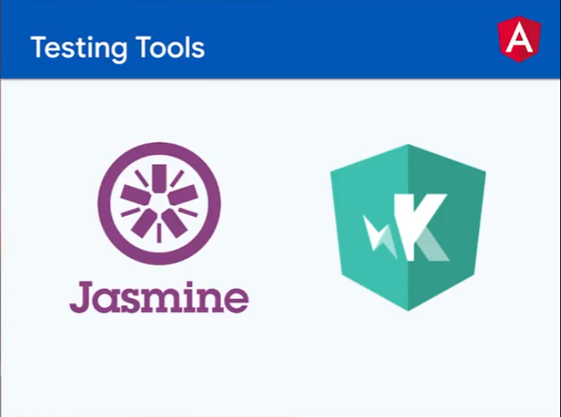
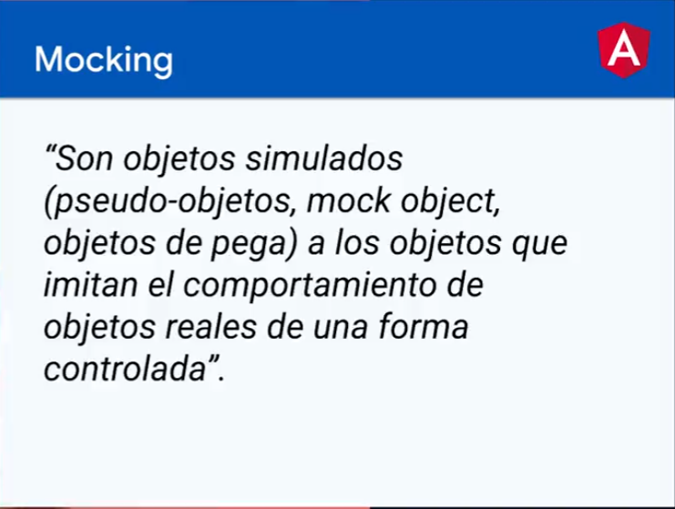

# CURSO DE ANGULAR 05: ANGULAR FORMS

[LINK DEL CURSO](https://platzi.com/clases/2897-angular-unit-testing-servicios/47472-jest-vs-jasmine-entornos-de-testing-para-angular/)

# LINK TO GITHUB PROJECT

[LINK TO GITHUG PROJECT platzi](https://github.com/platzi/curso-angular-unit-testing-servicios/)

# LINK TO APP IN PRODUCTION NETLIFY

[LINK TO APP IN PRODUCTION NETLIFY]()

## CREATED BY

Juan Manuel Luna Blanco
[Instagram: gotth3way](https://www.instagram.com/gotth3way.apis/)
[Instagram: Kryptonite](https://www.instagram.com/kryptonite.original/)

[Linkedin](https://www.linkedin.com/in/juan-manuel-luna-blanco-180a1570/)

[Youtube: desarrolladorhoy](https://www.youtube.com/channel/UCSEwIRkDJxLkbvKHOAcw_Xw)
[Youtube: Kryptonite](https://www.youtube.com/channel/UCSEwIRkDJxLkbvKHOAcw_Xw)

[LINK GITHUB PROYECT mine](https://github.com/JUANLUNABLANCO/curso-angular-testing)

## INSTALACIONES

> node -v                 // v16.17.0
> npm -v                  // 8.15.0
> npm i -g @angular/cli
> ng version              // 16.17.0

## CREAR UN PROYECTO CON EL CLI DE ANGULAR

// WARNING Este proyecto está creado con la versión 10.07 de angular, copiado del repo de platzi rama init

> ng new my-store-app-api
> cd my-store-app-api
> ng serve
> ng test

visit (http://localhost:4200)

## SOME THINGS OF THIS CLI

### MyStoreWithAngular

This project was generated with [Angular CLI](https://github.com/angular/angular-cli) version 15.0.4.

### Development server

Run `ng serve` for a dev server. Navigate to `http://localhost:4200/`. The application will automatically reload if you change any of the source files.

### Code scaffolding

Run `ng generate component component-name` to generate a new component. You can also use `ng generate directive|pipe|service|class|guard|interface|enum|module`.

### Build

Run `ng build` to build the project. The build artifacts will be stored in the `dist/` directory.

### Running unit tests

Run `ng test` to execute the unit tests via [Karma](https://karma-runner.github.io).

### Running end-to-end tests

Run `ng e2e` to execute the end-to-end tests via a platform of your choice. To use this command, you need to first add a package that implements end-to-end testing capabilities.

### Further help

To get more help on the Angular CLI use `ng help` or go check out the [Angular CLI Overview and Command Reference](https://angular.io/cli) page.


## Arrancar el servidor de desarrollo

> ng serve -o                 // servir el proyecto
> ng serve -o --port=3500     //  en el puerto especificado
> ng version

```
     _                      _                 ____ _     ___
    / \   _ __   __ _ _   _| | __ _ _ __     / ___| |   |_ _|
   / △ \ | '_ \ / _` | | | | |/ _` | '__|   | |   | |    | |
  / ___ \| | | | (_| | |_| | | (_| | |      | |___| |___ | |
 /_/   \_\_| |_|\__, |\__,_|_|\__,_|_|       \____|_____|___|
                |___/
```

Angular CLI: 15.0.4
Node: 16.17.0
Package Manager: npm 8.15.0
OS: win32 x64
Angular: 15.0.4

... animations, cli, common, compiler, compiler-cli, core, forms
... platform-browser, platform-browser-dynamic, router

Package                         Version
---------------------------------------------------------
@angular-devkit/architect       0.1500.4
@angular-devkit/build-angular   15.0.4
@angular-devkit/core            15.0.4
@angular-devkit/schematics      15.0.4
@schematics/angular             15.0.4
rxjs                            7.5.7
typescript                      4.8.4

## Archivos importantes de Configuración

### archivos de configuración de typescript y angular

tsconfig.json
tsconfig.app.json
tsconfig.spec.json


### browser listado de compatibilidades

.browserlistrc


### editor

.editorconfig


### angular

angular.json


### testing

karma.conf.json


### Node version manager

.nvmrc

### Extensiones de VSC

Angular language Service
editor config
eslint

## Linter para el proyecto

> npm install eslint --save-dev   // lo instala

## ESLINT EXTENSION

The extension uses the ESLint library installed in the opened workspace folder. If the folder doesn't provide one the extension looks for a global install version. If you haven't installed ESLint either locally or globally do so by running <b>npm install eslint</b> in the workspace folder for a local install or npm install -g eslint for a global install.

On new folders you might also need to create a .eslintrc configuration file. You can do this by either using the VS Code command Create ESLint configuration or by running the eslint command in a terminal. If you have installed ESLint globally (see above) then run

> eslint --init

in a terminal. If you have installed ESLint locally then run

> .\node_modules\.bin\eslint --init

under Windows and ./node_modules/.bin/eslint --init under Linux and Mac.

## Aplicar un Linter (buenas prácticas de angular)

> ng lint // comando para revisar el código, sino hay ningún linter, nos informa de los linters disponibles en angular

Instalaremos este

> ng add @angular-eslint/schematics

Y ahora si podemos ejecutar el comando anterior
> ng lint // ahora analizará el código en busca de errores

al ejecutarlo nos muestra los errores y malas practicas, hay algunos que no se pueden evitar, deberíamos poder deshabilitar el error o el warning de alguna manera

También puedes modificar e implementar tus propias reglas de codificación editando el archivo .eslintrc.json que fue creado en la raíz del proyecto.


## SOME PROBLEMS WITH TSCONFIG

If you receive this problem for the linter in some files:

  parsing error: Cannot read file 'tsconfig.json'

That is because, the linter cannot find this tsconfig.json

Do that:

 .eslintrc.json
```
        "project": [
          "tsconfig.json"
        ],

        cambia esa línea por la siguiente

        "project": [
          "**/tsconfig.json"
        ],
```

## SOME PROBLEMS WITH .eslintrc.json

if you recibe this problem in the .eslintrc.json:

  "No inputs where found in config file"

You can change that in this file:

 .eslintrc.json
```
{
  "compilerOptions": {
    "moduleResolution": "node"
  }
}
```

 to

 .eslintrc.json
```
{
  "compilerOptions": {
    "moduleResolution": "node"
  },
  "include": [
    "./src/**/*.ts"
  ]
}
```


## GIT CONFIGURATIONS

git init
git config --local user.email "desarrolloaplicacionesweb.jmlb@gmail.com"
git config --local user.name "JUANLUNABLANCO"
git branch -M  main

	En este punto debes crear un repositorio nuevo en github vac铆o y enlazarlo

	> git remote add origin https://github.com/JUANLUNABLANCO/<tu-repo>.git -->


	> git remote add origin https://github.com/JUANLUNABLANCO/curso-angular-testing.git
	> git config --list
	> git add .
	> git commit -m "scaffolding project with webpack"
	> git push -u origin main

## PROBLEMAS CON EL EOL EN W10

> git config --global core.autocrlf true

pondrá todos los ficheros que tengan un salto de línea en \r\n, que es lo que necesita windows, en vez de
\n que es lo que necesita los sistemas unix

con eso, en el README.md podrás leerlo como se espera

tras esa configuración y para que surta efecto debes de hacer lo siguiente

> git add --renormalize .

> git commit -m "Renormalizing eofile eolines"

> git push origin main

// IMPORTANTE el codigo de los ficheros debe ser copiado directamente en el README.md entre 
``` comillas ``` para que se vea bien, porque por defecto un fichero de código borra los eol.


## Extensiones del navegador

	JSON Formatter
	Angular dev tools << DEPENDIENDO DEL TIPO DE TECNOLOGÍA HABRÁ UNA U OTRA >>

## Cliente APIS
	### apps externas
	
		Insomnia.rest << DEPENDIENDO DEL TIPO DE TECNOLOGÍA HABRÁ UNA U OTRA >>
		Postman

	### extension de VSC

		Thunder client << DEPENDIENDO DEL TIPO DE TECNOLOGÍA HABRÁ UNA U OTRA >>

## npm aditional installations

  // WARNING Este está en el original, nose si nos hará falta "@types/node": "^12.11.1",
  // y este lo habiamos instalado para ejecutar typescript sin necesidad de build en otros proyectos.
  // > npm install --save-dev ts-node ????


## SOME STUFF PROBLEMS IN ANGULAR WITH EXTERNAL DEPENDENCIES

angular warning: files.service.ts depends on 'file-saver'. CommonJS or AMD dependencies can cause optimization bailouts.

SOLUTION:

angular.json
```
"projects": {
            ...
            "architect": {
                "build": {
                    "builder": "@angular-devkit/build-angular:browser",
                    "options": {
                        "outputPath": "dist",
                        "index": "src/index.html",
                        "main": "src/main.ts",
                        "polyfills": [
                            "zone.js"
                        ],
                        "tsConfig": "tsconfig.app.json",
                        // ############################# ADDED
                        "karmaConfig": "karma.conf.js",
                        // ############################# ADDED
                        "inlineStyleLanguage": "scss",
                        "assets": [
                            "src/favicon.ico",
                            "src/assets"
                        ],
                        "styles": [
                            "src/styles.scss"
                        ],
                        "scripts": [],
// ADDED 
                        "allowedCommonJsDependencies": ["file-saver"]
// ADDED 

```

listo wei, solucionado


## star course

## testing- introduction [vídeo-1]



## Jest vs. Jasmine [vídeo-2]


Estos matchers, son exactamente igulaes a los de jest:


Karma.config es la configuración del test runner de karma

un archivo de pruebas tipico es aquel que se genera automáticamente con el cli cuando creamos un ocmponente o un servicio o lo que sea y termina en .spec.ts dentro de la carpeta del propio componente o servicio.

app.component.spec.ts
```
import { TestBed } from '@angular/core/testing';
import { AppComponent } from './app.component';

describe('AppComponent', () => {
  beforeEach(async () => {
    await TestBed.configureTestingModule({
      declarations: [
        AppComponent
      ],
    }).compileComponents();
  });

  it('should create the app', () => {
    const fixture = TestBed.createComponent(AppComponent);
    const app = fixture.componentInstance;
    expect(app).toBeTruthy();
  });

  it(`should have as title '07-curso-angular-testing'`, () => {
    const fixture = TestBed.createComponent(AppComponent);
    const app = fixture.componentInstance;
    expect(app.title).toEqual('07-curso-angular-testing');
  });

  it('should render title', () => {
    const fixture = TestBed.createComponent(AppComponent);
    fixture.detectChanges();
    const compiled = fixture.nativeElement as HTMLElement;
    expect(compiled.querySelector('.content span')?.textContent).toContain('07-curso-angular-testing app is running!');
  });
});
```

El '.spec' viene de especificaciones del contrato entre, el test o requisitos de prueba y la app

Podría llamarse '.test' sin problemas, pero angular nos lo proporciona así.

> ng test

// CONFIGURATION EXTRA

Hay que configurar algunas cosas en w10, debes tener WSL instalado

Hay que instalar un chrome en el core de linux para que funcionen las pruebas???

Esto sería, en WSL línea de comandos:

```
sudo apt update && sudo apt -y upgrade && sudo apt -y autoremove

wget https://dl.google.com/linux/direct/google-chrome-stable_current_amd64.deb
sudo apt -y install ./google-chrome-stable_current_amd64.deb

google-chrome --version
```
Esto es para versiones anteriores de angular, puesto que con esta version v15.0^ no he necesitado hacer nada de esto y funciona perfectamente. Y si escribimos google-chrome --version en consola no existe ese comando.

Después deberías poner en Karma.conf.js esto

        browsers: ['Chrome'],  // sustituir por esto otro  
        browsers: ['ChromeHeadless'],


// WARNING 

De hecho, no tengo karma.con.js, no tengo WSL, no tengo instalado el google-chrome en el wsl, y hago ng test y funciona, no es necesario en versiones superiores a v15.0, configurar karma

// WARNING 

## Primeras pruebas con angular [vídeo-3]

creamos una simulación de calculadora

calculator.ts
```
export class Calculator {
  multiply(a: number, b: number) {
    return a * b;
  }

  divide(a: number, b: number) {
    if (b === 0) {
      return null;
    }
    return a / b;
  }
}
```

calculator.spec.ts
```
import { Calculator } from './calculator';

describe('Test for Calculator', () => {
  it('#multiply should return a nine', () => {
    //Arrange
    const calculator = new Calculator();
    //Act
    const rta = calculator.multiply(3,3);
    //Assert
    expect(rta).toEqual(9);
  });
  it('#multiply 1*4 should return a 4', () => {
    //Arrange
    const calculator = new Calculator();
    //Act
    const rta = calculator.multiply(1,4);
    //Assert
    expect(rta).toEqual(4);
  });
  it('#divide some numbers should return a null o numbers', () => {
    //Arrange
    const calculator = new Calculator();
    //Act
    expect(calculator.divide(9,0)).toEqual(null);
    //
    expect(calculator.divide(9,1)).toEqual(9);
  });
  it('#divide some numbers should return a null o numbers', () => {
    //Arrange
    const calculator = new Calculator();
    //Act
    expect(calculator.divide(9,0)).toEqual(null);
    //
    expect(calculator.divide(9,.5)).toBeGreaterThan(10);
    expect(calculator.divide(9,.5) === 18).toBeTruthy();
  });
});

```

## Explorando matchers [vídeo-04]
## reporte de cobertura [vídeo-5]

> ng test --no-watch --code-coverage

```
=============================== Coverage summary ===============================
Statements   : 100% ( 7/7 )
Branches     : 100% ( 1/1 )
Functions    : 100% ( 3/3 )
Lines        : 100% ( 6/6 )
================================================================================
```

A parte de esta información obtenemos una web en la carpeta coverage

si pones fdescribe delante de una prueba, solo ejecutará esa prueba
  1. con fdescribeejecuta únicamente el suite de test

  2. con xdescribe se omite el suite de test

  3. con fit ejecuta el focus sobre un test

  4. con xit se omite un test

además se focalizará para ver si se ejecutan o no, todas las líneas de ese fdescribe()

Podemos forzar a un 80& de cobertura, para que de error, ...

karma.con.js
```
 ...
 
  coverageReporter: {
      dir: require('path').join(__dirname, './coverage/ng-testing-services'),
      subdir: '.',
      // #################### added
      reporters: [
          { type: 'html' },
          { type: 'text-summary' }
      ],
      check: {
        global: {
          statements: 80,
          branches: 80,
          functions: 60,
          lines: 80
        }
      }
      // #################### added
```

// NO ME HACE NI CASO

karma.conf.js
```
// Karma configuration file, see link for more information
// https://karma-runner.github.io/1.0/config/configuration-file.html

module.exports = function(config) {
    config.set({
        basePath: '',
        frameworks: ['jasmine', '@angular-devkit/build-angular'],
        plugins: [
            require('karma-jasmine'),
            require('karma-chrome-launcher'),
            require('karma-jasmine-html-reporter'),
            require('karma-coverage'),
            require('@angular-devkit/build-angular/plugins/karma')
        ],
        client: {
            jasmine: {
                // you can add configuration options for Jasmine here
                // the possible options are listed at https://jasmine.github.io/api/edge/Configuration.html
                // for example, you can disable the random execution with `random: false`
                // or set a specific seed with `seed: 4321`
            },
            clearContext: false // leave Jasmine Spec Runner output visible in browser
        },
        jasmineHtmlReporter: {
            suppressAll: true // removes the duplicated traces
        },
        coverageReporter: {
            dir: require('path').join(__dirname, './coverage/ng-testing-services'),
            subdir: '.',
            reporters: [
                { type: 'html' },
                { type: 'text-summary' }
            ],
            check: {
                global: {
                    statements: 80,
                    branches: 80,
                    functions: 80,
                    lines: 80
                }
            }
        },
        reporters: ['progress', 'kjhtml'],
        port: 9876,
        colors: true,
        logLevel: config.LOG_INFO,
        autoWatch: true,
        browsers: ['ChromeHeadless'],
        singleRun: false,
        restartOnFileChange: true
    });
};
```

## Mocha reporter [vídeo-6]

> npm i karma-mocha-reporter --save-dev


karma.conf.js
```
// Karma configuration file, see link for more information
// https://karma-runner.github.io/1.0/config/configuration-file.html

module.exports = function(config) {
    config.set({
        basePath: '',
        frameworks: ['jasmine', '@angular-devkit/build-angular'],
        plugins: [
            require('karma-jasmine'),
            require('karma-chrome-launcher'),
            require('karma-jasmine-html-reporter'),
            require('karma-coverage'),
            require('@angular-devkit/build-angular/plugins/karma'),
            // ADDED HERE ########################################
            require('karma-mocha-reporter')
            // ADDED HERE ########################################
        ],
        client: {
            jasmine: {
                // you can add configuration options for Jasmine here
                // the possible options are listed at https://jasmine.github.io/api/edge/Configuration.html
                // for example, you can disable the random execution with `random: false`
                // or set a specific seed with `seed: 4321`
            },
            clearContext: false // leave Jasmine Spec Runner output visible in browser
        },
        jasmineHtmlReporter: {
            suppressAll: true // removes the duplicated traces
        },
        coverageReporter: {
            dir: require('path').join(__dirname, './coverage/ng-testing-services'),
            subdir: '.',
            reporters: [
                { type: 'html' },
                { type: 'text-summary' }
            ],
            check: {
                global: {
                    statements: 90,
                    branches: 90,
                    functions: 90,
                    lines: 90
                }
            }
        },
        // CHANGED HERE ########################################
        // reporters: ['progress', 'kjhtml']
        reporters: ['mocha'],
        // CHANGED HERE ########################################
            
        port: 9876,
        colors: true,
        logLevel: config.LOG_INFO,
        autoWatch: true,
        browsers: ['ChromeHeadless'],
        singleRun: false,
        restartOnFileChange: true
    });
};
```

calculator.spec.ts
```
describe('Test for Calculator', () => {
  describe('Multiuply()', ()=> {

```
anidamiento de describe for better logs

## Pruebas de servicios [vídeo-7]

> ng generate service value

value.service.ts
```
import { Injectable } from '@angular/core';
import { of } from 'rxjs';

@Injectable({
  providedIn: 'root'
})
export class ValueService {

  private value = 'my value';

  constructor() { }

  getValue(): string {
    return this.value;
  }
  setValue(value: string) {
    this.value = value;
  }

  getpromiseValue() {
    return Promise.resolve('promise value');
  }

  getObservableValue() {
    return of('observable value');
  }
}
```

value.spec.ts
```
import { 'ValueService' } form './value.service';
beforeEach(()=>{ // se usará una nueva instancia en cada it
  let service = new ValueService();
});
it(()=>{ // primera prueba obligatoria para ver que el servicio fue creado
  expect(service).toBeTruthy();
})
// promesas con then() y doneFN
it('should return "promise value" from a promise', (doneFn)=>{
      service.getPromiseValue()
      .then((value)=>{
        expect(value).toBe("promise value");
        doneFn();
      });


// promesas con async await
describe('Tests for getPromiseValue()', ()=>{
    it('should return "promise value" from a promise', async ()=>{
      const rta = await service.getPromiseValue()
      expect(rta).toBe("promise value");
      });
    });
```

con fdescribe() se focaliza en ese describe y las demás pruebas no las realiza

## servicios con dependencias [vídeo-8]

> ng g s services/master

master.service no hace literalmente nada solo llama value.service, para que podamos entender un servicio que depende de otro.

value.service.ts
```
import { Injectable } from '@angular/core';
import { ValueService } from './value.service';

@Injectable({
  providedIn: 'root'
})
export class MasterService {

  constructor(
    private valueService: ValueService
  ) { }

  getValue() {
    return this.valueService.getValue();
  }
}
```

master.service.spec.ts
```
import { MasterService } from './master.service';
import { ValueService } from './value.service';

describe('MasterService', () => {
  it('should return 'my value' from the real service (valueService)', ()=>{
    let valueService: new ValueService();
    let masterService: new MasterService(valueService);
    expect(masterService.getValue()).toBe('my value');
  });
});
```
Esto debería funcionar perfectamente, > ng test funciona
pero mira esto


cual es la responsabilidad de cada servicio,
  1. en value.service es obtener un valor,
  2. pero en master.service es ejecutar un método de value.service

Las responsabilidades son diferentes, pero value.service ya tiene pruebas válidas en value.service.spec, por tanto para probar master.service no necesitamos probar value.service ni sus métodos.

Por este motivo, debemos crear un servicio fake de value.service que haga el trabajo sucio de la dependencia de value.service en vez de llamar directamente a value.service, a esta técnica de testing se le llama creación de mocks para testing

> ng g s services/value-fake  // no hagas esto, no es un servicio, es una clase sin inyección de dependencias ni nada

value-fake.service.ts
```
export class FakeValueService {

  constructor() { }

  getValue() {
    return 'fake value'; // lo retorna directamente sin this.value;
  }

  setValue(value: string) {}

  getPromiseValue() {
    return Promise.resolve('fake promise value');
  }
}
```

La responsabilidad de valueService es retornar un valor
la responsabilidad de masterService es comprobar si funciona su metodo getValue(), que llama a ValueService, por ende los valores o la logica de esa clase no nos interesa.

Es por esto que no usaremos una clase real sino fake, porque no nos importa que haga esa clase sino el resultado de la misma

value-fake.service.ts
```
export class FakeValueService {

  constructor() { }

  getValue() {
    return 'fake value';
  }

  setValue(value: string) {}

  getPromiseValue() {
    return Promise.resolve('fake promise value');
  }
}
```

value-fake.service.ts
```
import { MasterService } from './master.service';
import { ValueService } from './value.service';
import { FakeValueService } from './value-fake.service';

describe('MasterService', () => {
  it('should return "my value" from the real service', () => {
    const valueService = new ValueService();
    const masterService = new MasterService(valueService);
    expect(masterService.getValue()).toBe("my value");
  });
  it('should return "some value" from the fake service', () => {
    const fakeValueService = new FakeValueService();
    const masterService = new MasterService(fakeValueService as unknown as ValueService);
    expect(masterService.getValue()).toBe("fake value");
  });
});
```


Esta forma no es recomendada, porque hay que mantener una clase fake que depende de los cambios de value.service.ts Es mejor con un objeto fake, en el mismo test.

master.service.spec.ts
```
  it('should return "some value" from the fake object', () => {
    const fake = {getValue: ()=> 'fake from obj'};
    const masterService = new MasterService(fake as ValueService);
    expect(masterService.getValue()).toBe("fake from obj");
  });
```

Ahora todo junto, que sabemos funciona, pero que optaremos por la primera o la segunda estrategia

master.service.spec.ts
```
  import { FakeValueService } form './fake-value-service';

  // ESCALABLE Y MANTENIBLE, llamada al servicio real
  // Estrategia usando los servicios reales, usado en servicios simples
  it('should return "my value" from the real service', () => {
    let valueService: new ValueService();
    const masterService = new MasterService(valueService);
    expect(masterService.getValue()).toBe("my value");
  });

  // Estrategia con mock del servicio // NO uses esta estrategia porque estás doblando código y si value cambia debes cambiar el mock
  // INMANTENIBLE NO LO USES
  it('should return "some value" from the fake service', () => {
    // y usamos ese mock de value.service --> value-fake.service
    const fakeValueService = new FakeValueService();
    // haciéndolo pasar por el real

    // WARNING esto es muy duro tio!!! fakeValueService as unknown as ValueService!!!
    const masterService = new MasterService(fakeValueService as unknown as ValueService);
    expect(masterService.getValue()).toBe("fake value");
  });
  // INMANTENIBLE NO LO USES

  // ESCALABLE Y MANTENIBLE. Creación de un objeto literal al vuelo que simula el servicio.
  // Estrategia usando un objeto al vuelo que simula el servicio, para suplantar el servicio real, debido a cuestiones de $$ y velocidad, imagina que el servicio es una API externa que consume $$ en cada petición, por ejemplo GOOGLEMAPS, ... O pagos con tarjetas, ...
  it('should return "some value" from the fake object', () => {
    const fake = {getValue: ()=> 'fake from obj'};
    const masterService = new MasterService(fake as ValueService);
    expect(masterService.getValue()).toBe("fake from obj");
  });
  // ESCALABLE Y MANTENIBLE.
```

// WARNING antes de usar ninguno de estos debes saber que existen 'los espías', es una etsrategia de testing para saber si un servicio, o método se usó, lo llama pero sustituye los datos devueltos del método real, // OJOCUIDAO con esto, quizás en casos donde el test acceda a servicos de terceros con costos '$$', esta no sea una buena estartegia.

## Spies [vídeo-9]

Saber si se ha llamado a un método de una clase, usando spies.


// ESTRATEGIA DE ESPIAS, mejor que con value-fake.service y fakeObject
master.service.spec.ts
```
  it('should call a getValue() from valueService', () => {
    const valueServiceSpy = jasmine.createSpyObj('ValueService', ['getValue']); // ahora usará el método getValue de la clase ValueService
    valueServiceSpy.getValue.and.returnValue('fake spy value');   // simula el envío con este mock

    const masterService = new MasterService(valueServiceSpy);  // ahora podemos usar ese valueServiceSpy sin problemas de tipado

    // y ya podemos hacer las pruebas que necesitemos
    // podemos usar el masterService si queremos
    expect(masterService.getValue()).toBe("fake spy value");    // qué recibe del fake, se podría oviar esta prueba, no importa mucho que retorne en este caso, además es simulado.

    // o directamente el spía, que se cerciora de que se usa getValue desde masterService llamando a valueService
    expect(valueServiceSpy.getValue).toHaveBeenCalled();        // ¿fue llamado el método?
    expect(valueServiceSpy.getValue).toHaveBeenCalledTimes(1);  // ¿cuantas veces fue llamado?
  });
```




## Angular testbed [vídeo-10]

value.service.spec.ts
```
import { TestBed } from '@angular/core/testing';
import { ValueService } from './value.service';

describe('ValueService', () => {
  let service: ValueService;

  beforeEach(() => {
    TestBed.configureTestingModule({  // crea un módulo isolado (independiente del resto para pruebas)
      providers: [ ValueService ]
    });
    // service = new ValueService(); // sustituimos esto ahora es un servicio inyectado en el modul ode pruebas

    service = TestBed.inject(ValueService); // se crea una instancia con el patron singleton en toda la app
  });
```

value.service.spec.ts
```
import { TestBed } from '@angular/core/testing';

import { MasterService } from './master.service';
import { ValueService } from './value.service';
import { FakeValueService } from './value-fake.service';


describe('MasterService', () => {
  let masterService: MasterService;
  let valueService: ValueService;
  let fakeValueService: FakeValueService;
  beforeEach(()=>{
    TestBed.configureTestingModule({
      providers: [ // esta sería la forma correcta de crear este módulo, inyectando todo lo necesario,
      // WARNING NO EXACTAMENTE SIGUE MIRANDO LOS VÍDEOS ...
        MasterService,
        ValueService,
        FakeValueService
        ]
    });
    masterService = TestBed.inject(MasterService);
    valueService = TestBed.inject(ValueService);
    fakeValueService = TestBed.inject(FakeValueService);
  });
```


## TestBed + Spies [vídeo-11]

master.service.spec.ts
```
import { TestBed } from '@angular/core/testing';

import { MasterService } from './master.service';
import { ValueService } from './value.service';
// import { FakeValueService } from './value-fake.service';


describe('MasterService', () => {
  // variables inicializació
  let masterService: MasterService;
  let valueServiceSpy: jasmine.SpyObj<ValueService> // tipo spyObj que se hace pasar por un ValueService

  beforeEach(()=>{
    // creamos primero el espía que usaremos en MasterService
    const spy = jasmine.createSpyObj('ValueService', ['getValue']);
    // ahora el módulo para testing con ambas dependencias el servicio y el espia dependiente del propio servicio
    TestBed.configureTestingModule({
      // declaramos los providers del modulo
      providers: [
        MasterService, { provide: ValueService, useValue: spy } // useValue (sustituyelo por ...)
      ]
    });
    // i finalmente se inyectan para ser usados
    masterService = TestBed.inject(MasterService);
    valueServiceSpy = TestBed.inject(ValueService) as jasmine.SpyObj<ValueService>;
  });

  // ESTA PRUEBA SIEMPRE HA DE REALIZARSE, de echo angular te la pone por defecto
  it('should be create masterService',()=>{
    expect(masterService).toBeTruthy();
  });

  it('should call a getValue() from valueService', () => {
    // INNECESARY const valueServiceSpy = jasmine.createSpyObj('ValueService', ['getValue']); // es un spy inyectado
    valueServiceSpy.getValue.and.returnValue('fake spy value');   // simula el envío del valor a través del espia
    // INNECESARY const masterService = new MasterService(valueServiceSpy); // ya no necesitamos crearlo directamente, xqw está inyectado
    expect(masterService.getValue()).toBe("fake spy value");    // qué recibe
    expect(valueServiceSpy.getValue).toHaveBeenCalled();        // ¿fue llamado el método?
    expect(valueServiceSpy.getValue).toHaveBeenCalledTimes(1);  // ¿cuantas veces fue llamado?
  });
});
```


## Setup y maquetación del proyecto [vídeo-12]

Frameworks minimos de css semánticos (sin clases) para maquetación:
  1. [Milligram](https://milligram.io/)

  2. [Simple.css](https://simplecss.org/)

  3. [Pico.css](https://picocss.com/)


  > npm install @picocss/pico

angular.json
```
  "styles": [
      "src/styles.scss",
      "node_modules/@picocss/pico/css/pico.min.css"
  ],
```

Usar etiquetas html semánticas

solo tiene una clase 
class="container" que deberías usar para hacerlo

<html lan="en" data-theme="light">

> ng g components/products
> ng g components/pico-preview

app.component.html
```
<header class="container">
    <h1>Angular testing</h1>
    <p>Lorem ipsum dolor sit amet, consectetur adipisicing elit. Magnam, eum excepturi! Temporibus, cumque suscipit, hic porro ipsa aliquam, voluptatum totam voluptatibus velit nulla corporis rem eos iusto. Unde, sequi quibusdam?</p>
    <nav>
        <ul>
            <li><a routerLink="/">Home</a></li>
            <li><a routerLink="/products">Productos</a></li>
            <li><a routerLink="/pico-preview">Pico Preview</a></li>
        </ul>
    </nav>
</header>
<router-outlet></router-outlet>
```

app-routing.module.ts
```
import { NgModule } from '@angular/core';
import { RouterModule, Routes } from '@angular/router';

import { ProductsComponent } from './components/products/products.component';
import { PicoPreviewComponent } from './components/pico-preview/pico-preview.component';

const routes: Routes = [
  {
    path: 'products',
    component: ProductsComponent
  },
  {
    path: 'pico-preview',
    component: PicoPreviewComponent
  }
];

@NgModule({
  imports: [RouterModule.forRoot(routes)],
  exports: [RouterModule]
})
export class AppRoutingModule { }
```

products.component.ts
```
<section class="container">
    <h1>Products Component</h1>
    <div class="my-grid">
        <figure *ngFor="let product of products">
            
            <figcaption>
                {{product.title}} - {{product.price}}
            </figcaption>
        </figure>
    </div>
</section>
```

// VER pico-preview.component.html


## Product Services Http [vídeo-13]

No lo vamos a crear desde cero, sino que ...

copiamos los servicios y modelos del proyecto 'curso de angular router' rama production la última

Luego debes ir a app.module.ts y incorporar HttpClientModule y ReactiveFormsModule a las importaciones

app.module.ts
```
  import { HttpClientModule } from '@angular/common/http';
  import { ReactiveFormsModule } from '@angular/forms';
  ...
  imports: [
    HttpClientModule,
    ReactiveFormsModule
  ],
```

product.service.ts
```
import { Injectable } from '@angular/core';
import { HttpClient, HttpParams, HttpErrorResponse, HttpStatusCode } from '@angular/common/http';
import { retry, catchError, map } from 'rxjs/operators';
import { throwError, zip } from 'rxjs';

import { Product, CreateProductDTO, UpdateProductDTO } from './../models/product.model';
import { environment } from './../../environments/environment';

@Injectable({
  providedIn: 'root'
})
export class ProductsService {

  private apiUrl = `${environment.API_URL}/api/v1`;

  constructor(
    private http: HttpClient
  ) { }

  getByCategory(categoryId: string, limit?: number, offset?: number){
    let params = new HttpParams();
    if (limit && offset != null) {
      params = params.set('limit', limit);
      params = params.set('offset', offset);
    }
    return this.http.get<Product[]>(`${this.apiUrl}/categories/${categoryId}/products`, { params })
  }

  // Creamos este método simple para empezar con las pruebas de servicios y obtención de productos
  getAllSimple() {
    return this.http.get<Product[]>(`${this.apiUrl}/products`);
  }

  getAll(limit?: number, offset?: number) {
    let params = new HttpParams();
    if (limit && offset != null) {
      params = params.set('limit', limit);
      params = params.set('offset', offset);
    }
    return this.http.get<Product[]>(`${this.apiUrl}/products`, { params })
    .pipe(
      retry(3),
      map(products => products.map(item => {
        return {
          ...item,
          taxes: .19 * item.price
        }
      }))
    );
  }

  fetchReadAndUpdate(id: string, dto: UpdateProductDTO) {
    return zip(
      this.getOne(id),
      this.update(id, dto)
    );
  }

  getOne(id: string) {
    return this.http.get<Product>(`${this.apiUrl}/products/${id}`)
    .pipe(
      catchError((error: HttpErrorResponse) => {
        if (error.status === HttpStatusCode.Conflict) {
          return throwError('Algo esta fallando en el server');
        }
        if (error.status === HttpStatusCode.NotFound) {
          return throwError('El producto no existe');
        }
        if (error.status === HttpStatusCode.Unauthorized) {
          return throwError('No estas permitido');
        }
        return throwError('Ups algo salio mal');
      })
    )
  }

  create(dto: CreateProductDTO) {
    return this.http.post<Product>(`${this.apiUrl}/products`, dto);
  }

  update(id: string, dto: UpdateProductDTO) {
    return this.http.put<Product>(`${this.apiUrl}/products/${id}`, dto);
  }

  delete(id: string) {
    return this.http.delete<boolean>(`${this.apiUrl}/products/${id}`);
  }
}
```

product.component.html
```
<section class="container">
    <h1>Products Component</h1>
    <div class="my-grid">
        <figure *ngFor="let product of products">
            
            <figcaption>
                {{product.title}} - {{product.price}}
            </figcaption>
        </figure>
    </div>
</section>
```

ya tenemos products component y el servicio que trae los productos desde la api:

// API https://api.escuelajs.co/api/v1/products

también tenemos el html que lo renderiza y el css de una grilla

products.component.scss
```
.my-grid {
    display: grid;
    grid-template-columns: repeat(4, 1fr);
    grid-template-rows: auto;
    grid-gap: 1rem;
}
```

Vamos a ver cómo hacemos pruebas de un sertvicio y de http


## HttpClientTestingModule [vídeo-14]

En anteriores servicios que solo gestionaban los datos sin hacer peticiones http usábamos esto:

TestBed.configureTestingModule, pero ahora vamos a usar ClientHttpModule de angular para realizar peticiones, usaremos otra forma para esto:

1. No tenemos en el frontend responsabilidad de la API, si funciona o no, es responsabilidad de los señores de backend. Qué devuelve cuando el servicio cae o falla, ...

2. Por ello haremos mocking de esa solicitud, usando HttpClientTestingModule y HttpTestingController

products.service.spec.ts
```
import { TestBed } from '@angular/core/testing';
import {
  // para inyectar el modulo HttpClientModule que es una dependencia del productsService
  HttpClientTestingModule,

  // nos permitirá hacer el mocking de las peticiones
  HttpTestingController 
  } from '@angular/common/http/testing';

import { ProductsService } from './products.service';
import { Product } from '../models/product.model';
import { environment } from './../../environments/environment';

// hemos hecho focus en este set de pruebas, porque las demás fallará mientras no implementemos ciertas cosas
fdescribe('ProductsService', () => {
  let productsService: ProductsService;
  // declaremos el controller
  let httpController: HttpTestingController;

  // se debe importar el HttpClientTestingModule en imports y el Product service en providers
  beforeEach(() => {
    TestBed.configureTestingModule({
      imports: [ HttpClientTestingModule ],
      providers: [
        ProductsService
      ]
    });
    productsService = TestBed.inject(ProductsService);
    httpController = TestBed.inject(HttpTestingController);
  });

  it('should be create', () => {
    expect(productsService).toBeTruthy();
  });

  describe('tests for getAllSimple', () => {
    it('should return a product list', (doneFn) => {
      // ARRANGE 
      const mockData: Product[] = [
        {
          id: '123',
          title: 'title',
          price: 12,
          description: 'blabla',
          category: {
            id: 112,
            name: 'as'
          },
          images: ['img','img']
        }
      ];
      // ACT 
      productsService.getAllSimple()
      .subscribe((data)=> {
        // ASSERT 
        expect(data.length).toEqual(mockData.length); // claro si es la misma, la has sustituido
        expect(data).toEqual(mockData);

        // esto es necesario pues nos hemos suscrito a un observable, y no podemos usar async await, xq no es una promesa, en el it('', (doneFn)) lo recibimos
        doneFn();
      });

      // http config, parte del Arrange, debe ir aquí
      const url = `${environment.API_URL}/api/v1/products`;

      const req = httpController.expectOne(url); // necesitamos este httpController para poder sutituir la ejecución de la petición antes que se produzca
      req.flush(mockData);  // reemplazar los datos que supuestamente la petición extraería si se ejecutara por estos otros ficticios del mock y para eso sirve el httpController.expectOne(url)

      httpController.verify(); // y verificará si usamos en algun test esta url pasada en expectOne, para actuar

    });
  });

});
```


## Generando mocks [vídeo-15]


¿Cómo generar data de mocks automáticamente?
Hay una librería que genera datos aleatorios de mocks:

> npm i @faker-js/faker --save-dev

ejemplo.de.uso
```
import { faker } from '@faker-js/faker';
// import { faker } from '@faker-js/faker/locale/de';

export const USERS: User[] = [];

export function createRandomUser(): User {
  return {
    userId: faker.datatype.uuid(),
    username: faker.internet.userName(),
    email: faker.internet.email(),
    avatar: faker.image.avatar(),
    password: faker.internet.password(),
    birthdate: faker.date.birthdate(),
    registeredAt: faker.date.past(),
  };
}

Array.from({ length: 10 }).forEach(() => {
  USERS.push(createRandomUser());
});
```
[-- saber más --](https://www.npmjs.com/package/@faker-js/faker)

es bueno crear los mocks dentro de la carpeta models

product.mock.ts
```
import {faker}  from '@faker-js/faker'

import { Product } from './product.model';

export const generateOneProduct = (): Product =>{
  return {
    id: faker.datatype.uuid(),
    title: faker.commerce.productName(),
    price: parseInt(faker.commerce.price(), 10),
    description: faker.commerce.productDescription(),
    category: {
      id: faker.datatype.number(),
      name: faker.commerce.department()
    },
    images: [faker.image.imageUrl(), faker.image.imageUrl()]
  };
};

export const generateProducts = (size: number = 10): Product[] => {
  const products: Product[] = [];
  for (let index=0; index= size; index++){
    products.push(generateOneProduct());
  }
  return [...products]; // para no tener problemas de mutación ???
};
```

Ahora se importa en el spec file

product.service.spec.ts
```
  import { generateManyProducts } from '../models/product.mock';
  ...
  const mockData: Product[] = generateManyProducts(6);
```

## Pruebas para GET [vídeo-16]

products.service.spec.ts
```
  describe('tests for getAll', () => {
    it('should return a product list', (doneFn) => {
      // Arrange
      const mockData: Product[] = generateManyProducts(3);
      // console.log(mockData);

      // Act
      productsService.getAll()
      .subscribe((data)=> {
        // Assert
        expect(data.length).toEqual(mockData.length);
        // WARNING aquí hay un error de tipo porque en el método getAll, después de recibir los datos, hacemos un map() y añadimos y cambiamos cosas, por ende hay que forzar a que devuelva un Observable<Product[]> en el método de product.service.ts llamado getAll
        // getAll(limit?: number, offset?: number): Observable<Product[]> {
        expect(data).toEqual(mockData);

        // WARNING !!!
        doneFn();
      });

      // http config, parte del Arrange
      const url = `${environment.API_URL}/api/v1/products`;
      const req = httpController.expectOne(url);
      req.flush(mockData);
      // httpController.verify();
    });
  });
```

products.service.spec.ts
```
  ...

  describe('tests for getAll', () => {
    it('should return a product list', (doneFn) => {
      // Arrange
      const mockData: Product[] = generateManyProducts(3);
      // console.log(mockData);

      // Act
      productsService.getAll()
      .subscribe((data)=> {
        // Assert
        expect(data.length).toEqual(mockData.length);
        // expect(data).toEqual(mockData); // no son iguales data tiene taxes
        doneFn();
      });

      // http config, parte del Arrange
      const url = `${environment.API_URL}/api/v1/products`;
      const req = httpController.expectOne(url);
      req.flush(mockData);
      httpController.verify();
    });
    it('Should return product list with taxes', (doneFn)=>{
      // Arrange
      const mockData: Product[] = [
        {
          ...generateOneProduct(),
          price: 100 // 100 * .19 = 19 taxes
        },
        {
          ...generateOneProduct(),
          price: 200 // 200 * .19 = 38 taxes
        }
      ];

      // Act
      productsService.getAll()
      .subscribe((data)=> {
        // Assert
        expect(data.length).toEqual(mockData.length);
        // OJOCUIDAO con esto, este dato de tax .19 debería estar en una variable de entorno y calcularlo tax= price * _TAX_
        expect(data[0].taxes).toEqual(19);
        expect(data[1].taxes).toEqual(38);
        doneFn();
      });

      // http config, parte del Arrange
      const url = `${environment.API_URL}/api/v1/products`;
      const req = httpController.expectOne(url);
      req.flush(mockData);
      httpController.verify();
    });
  });
});

```


## Pruebas maliciosas para get [vídeo-17]

## Pruebas para POST [vídeo-18]

## Pruebas para PUT y DELETE [vídeo-19]

## Pruebas a errores [vídeo-20]

## Pruebas con interceptores [vídeo-21]

## Pruebas al login [vídeo-22]

## Pruebas a la API del navegador [vídeo-23]

## GitHub Actions [vídeo-24]

## fin [vídeo-25]

##### CURSO DE ANGULAR: UNIT TESTING PARA COMPONENTES #####


